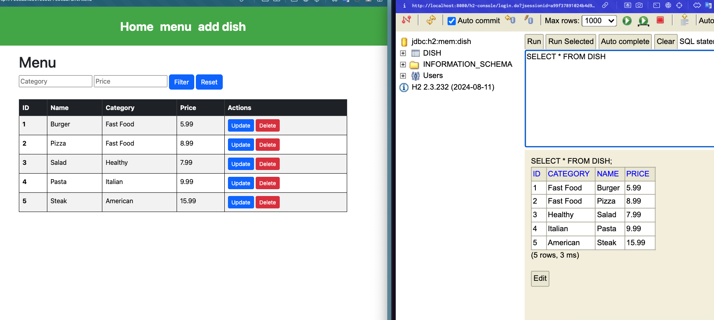
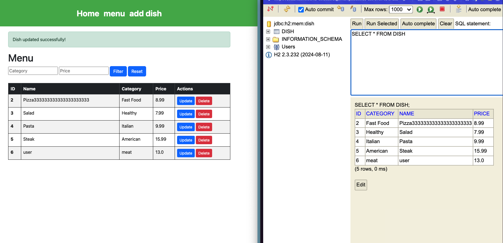
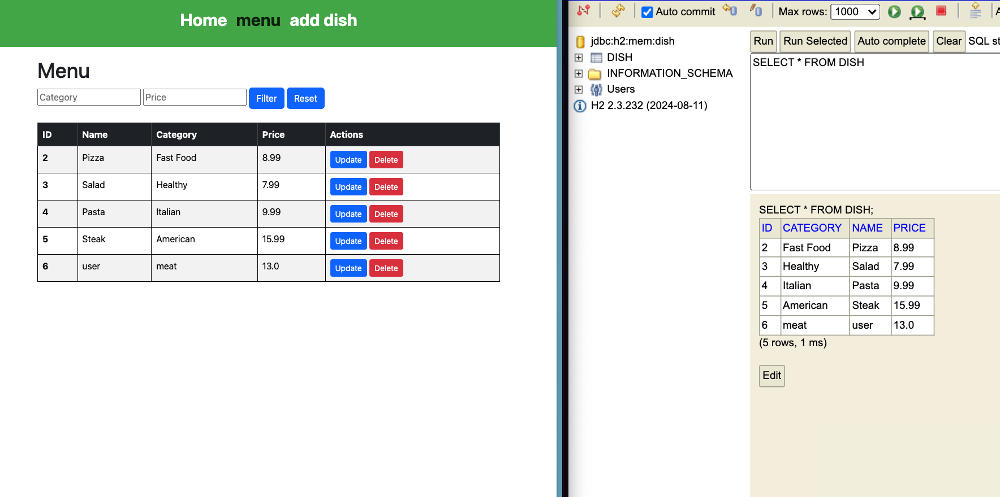
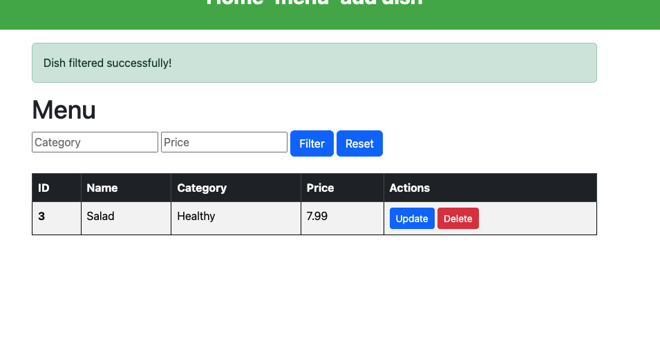
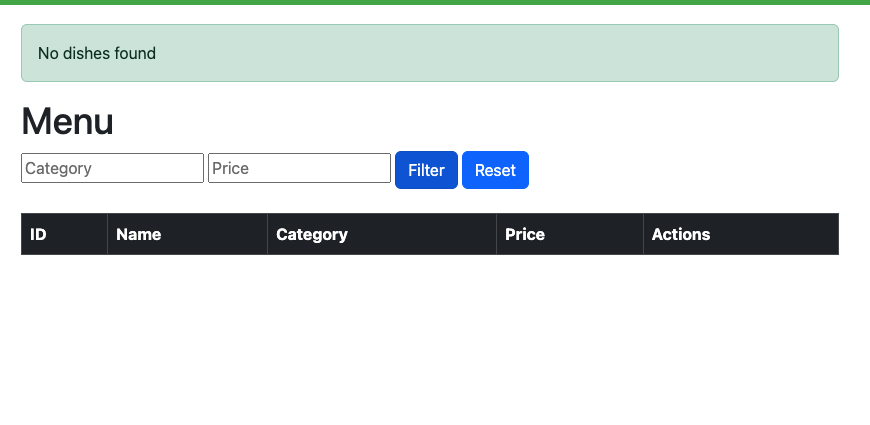

Update your previous MVC Spring Boot lab (restaurant project):

1. Implement Spring Data JPA instead of JDBC Template (update your model, repo, service and controller classes accordingly)
2. Add search/filter functionality (where the user needs to search by price and category)
3. Implement delete dish and update dish functionalities (utilize the same form for both the operations and use appropriate error/success messages)
4. All the operations that actually change the data in the DB should do that (make sure you attach screenshots of your H2 data as well)
5. Use data.sql file to prepopulate H2 with atleast 3 dish records. (Do not use schema.sql let Hibernate (JPA) handle the schema creation).
6. Move your business logic (if resides in controller) to the service class. 
7. Make sure you comment your code and make your frontend (Thymleaf) professional.

・function update button

・function delete button

・filter success or faild

